# Darba uzsākšana ar TRW 350 CNC frēzi

Šajā sadaļā ir atrodama informācija par to kā uzsākt darbu ar TRW 350 CNC frēzi. Pēc šīs sadaļas izlasīšanas, lietotājs spēs veikt sekojošās darbības.

1. Apzināties iespējamos veselības apdraudējumus un veikt to preventīvu novēršanu.
1. Ieslēgt iekārtu un veikt nepieciešamās pamatdarbības.
1. Uzstādīt materiālu iekārtas darba laukumā.
1. Uzstādīt iekārtas frēzes asmeni.
1. Iestatīt sākuma punktus iekāŗtas X, Y un Z asīm.
1. Ielādēt un palaist darba failu.

Darba faila sagatavošanai ieteicams izmantot Vectric V-Carve Pro programmatūru un tas tiks aprakstīts atsevišķā sadaļā.

## Darba drošība

TRW 350 CNC iekārta ir potenciāls drauds veselībai un pat dzīvībai, ja to lieto neapzinoties riskus un preventīvi tos nenovēršot. Ir svarīgi ievērot dažas pamatlietas, lai darba process ar CNC frēzi noritētu bez starpgadījumiem.

1. **Nesteidzies**. Ieplāno pietiekami daudz laika darba uzsākšanai, veikšanai un sakopšanai.
1. **Nestrādā ar iekārtu vienatnē**. Drošam darbam ar iekārtu ir nepieciešami vismaz divi cilvēki.
1. **Sakop pirms un pēc darba veikšanas**. Tīra darba vide ir primārs darba drošības priekšnoteikums.
1. **Novelc cimdus**, darbojoties ar iekārtas kustīgajām daļām.
1. **Izmanto aizsargbrilles un aizsargaustiņas** iekārtas darbības laikā.
1. **Brīdini apkārt esošos** par iekārtas darbības riskiem un tava darba plānu.

Aizsargaustiņas un aizsargbrilles var atrast uz iekārtas tuvumā ierīkotajām aprīkojuma plāksnēm.

## Iekārtas ieslēgšana un pamatdarbības

Sākot darbu ar TRW 350 CNC iekārtu, ir svarīgi pārliecināties par iekārtas darba laukuma tīrību. Darba stacija ir aprīkota ar putekļu sūcēju, ko ieteicams izmantot šī aspekta nodrošināšanai. Novāc visu lieko, kas varētu iespējami traucēt iekartas darbībai. Pievērs īpašu uzmanību liela izmēra materiāla plāksnēm, jo tās var nejauši gāzties vai arī vienkārši norobežot piekļuvi darbam svarīgiem instrumentiem.

### Ieslēgšana

Iekārtas ieslēgšanu jāveic secīgi:

1. Piespiež un tur "emergency stop" pogu.
2. Pagriež to pretēji pulksteņrādītāja virzienam un tad atlaiž.
3. Nospiež zaļo, ierīces strāvas padeves, pogu.
4. Sagaida, kamēr sistēma ir ielādējusies, tad nospiež melno "RESET" pogu.

Ja ekrānā redzama mirgojoša "ALARM" un/vai "WARN" daļa, atkārtoti jānospiež "RESET" poga. To visdrīzāk būs jālieto atkārtoti pēc pilnīgas programmatūras ielādes un gadījumā, ja tiek šķērsots darba drošībai uzstādītais lāzeržogs iekārtas darba virsmas priekšpusē.

Ir ieteicams pārliecināties par lāzeržoga atrašanās vietu, lai to nenāktos šķērsot nejaušā kārtā. Lāzeržoga starmetis ir piestiprināts pie sienas iekārtas kreisajā pusē aiz kontrolbloka.

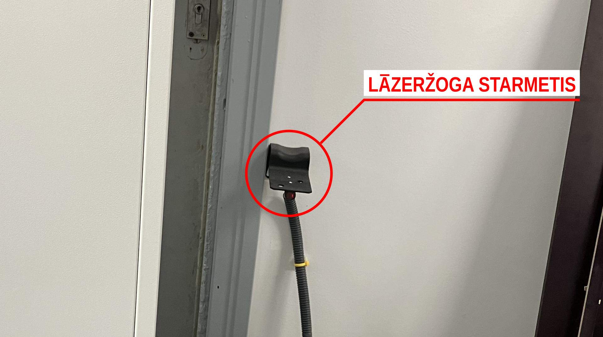

### Pamatdarbības

Pēc sistēmas pilnīgas ielādes, ir jāveic sekojošās darbības.

1. Sistēmas pašreģistrācija (ZRN funkcija).
2. Jānostata iekārtas tiltu tās tālākajā (ziemeļu) pusē.

Sistēmas pašreģistrācija ir nepieciešama iekārtas mehānisko ašu robežu noteikšanai un digitālai reģistrācijai. Šī automātiskā procedūra iestata iekārtu visiem zināmā sākumstāvoklī un tās gaitā var noteikt vai iekārta darbojas korekti. Lai sāktu pašreģistrācijas procesu, jāklikšķina uz **ZRN** pogas, izmantojot sistēmai pieslēgto datorpeli.

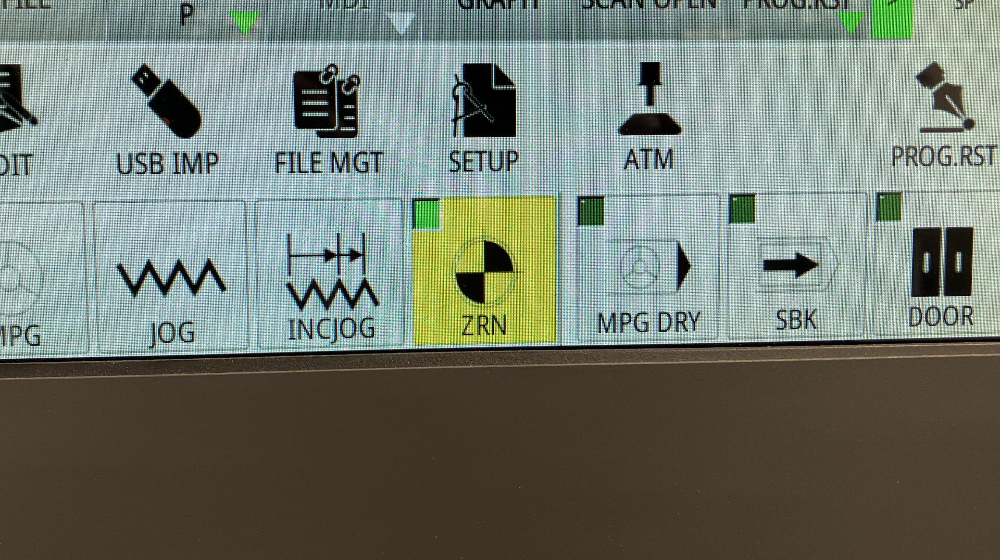

Pogai vajadzētu iekrāsoties dzeltenā krāsā. Tad jāspiež **START** poga.

Jānogaida, kamēr process noslēdzas. Iekārtas spindeļa modulim būtu jānostājas iekārtas dienvidrietumu augšējā pozīcijā.

Tad, izmantojot **JOG** funkciju, jānostata spindeļa moduli poszīcijā, kas būtu ērta darba virsmas sagatavošanai. Var izmanot **INCJOG** funkciju, ja ir nepieciešams mainīt kustības soļa izmēru (līdz pat 0.001mm).

## Darba virsmas sagatavošana

TRW 350 CNC frēze ir aprīkota ar vakuumgaldu un sliedēm stiprinājum-klemmēm. Starp apstrādei paredzēto materiālu un darba galdu nepieciešams ievietot "upurplati". Tā ir aptuveni 10 mm bieza poraina materilāla (MDF vai OBS) plāksne. "Upurplate" palīdz novērst iespēju sabojāt iekārtas galda virsmu neparedzētu kļūmju gadījumā, kā arī nodrošina gaisa plūsmu starp apstrādei paredzēto materiālu un vakuuma galdu. 

### Materiāla izvēle

Izvēloties materiālu detaļu izgatavošanai, ir svarīgi ņemt vērā iespējamās darba procesa neprecizitātes. Ir vienmēr labāk ierēķināt papildu 20mm platumam un garumam nekā riskēt ar detaļu neprecizitāti vai zemāku drošības standartu.

### Materiāla stiprināšana

Stingra materiāla nostiprināšana ir svarīgs priekšnosacījums ne tikai augstas kvalitātes rezultātam, bet arī drošībai. Frēzes rotācijas ātrums ir mērāma desmitos tūkstošu apgriezienos minūtē. Salīdzinājumam, pamēģini apgriezties ap savu asi kaut divdesmit reizes minūtē. Mēģini izplest rokas un aizskart kādu uz galda novietotu objektu. Novēro, kā objekts nevis vienkārši nokrīt no galda, bet no tā aizlido rotācijas virzienā. 

> Mēģini iztēloties, kas notiktu, ja tavs rotācijas ātrums būtu tūkstoš reizes ātrāks.

Darbā ar TRW 350 CNC iekārtu, ir pieejami divi materiāla stiprināšanas veidi, kas detalizēti aprakstīti zemāk.

### Materiāla stiprināšana ar klemmēm

Klemmes sastāv no četrām daļām.

1. Skrūves ar T-veida galvu, kas ir saderīga ar iekārtas galdā iebūvētajām sliedēm
2. Klemmes, kas paredzēta saskarei ar materiāla virsmu tās tievākajā galā, un iekārtas galdu resnākajā galā
3. Plastmasas ielikņa.
4. Tauriņveida uzgriežņa, klemmes pievilkšanai galda virzienā.

Klemmes nepieciešams "iebīdīt" iekārtas darba virsmas sliedēs. Zemāk attēls un video.

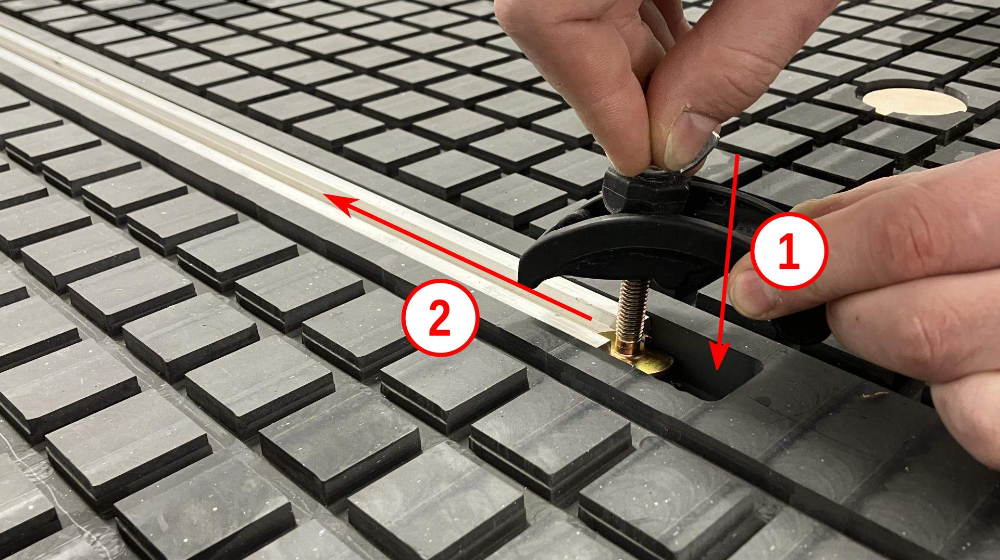

Pietiekamai materiāla stiprināšanai ieteicams izmantot 4 klemmes. Laba stiprināšanas prakse redzama attēlā zemāk.

### Materiāla stiprināšana ar vakuumgaldu

Atkarībā no materiāla izmēriem, nepieciešams atvērt vienu vai vairākus vakuuma vārstus. Katrs no deviņiem vārstiem atver vai noslēdz vakuuma ietekmi uz vienu no deviņiem vakuuma galda blokiem. Attēlā zemāk var redzēt staistību starp vakuuma vārstiem un vakuuma galda blokiem (skatoties no iekārtas priekšpuses).

Vakuuma galdu ieteicams izmantot liela izmēra (>1000x1000mm) materiāla plākšņu stiprināšanai. Nav ieteicams vakuumgaldu izmantot poraina materiāla stiprināšanai. 

Svarīgs priekšnosacījums korektai vakuuma galda darbībai ir gumijas blīvju ievietošana. Ieteicams šīs blīves darba galdā ievietot tā, lai tās ierobežotu gaisa plūsmu vietās, kur paredzēts stiprināt materiālu.

Tad secīgi jānovieto upurplate. Zemāk redzamajā video upurplates dienvidrietumu stūris tiek salāgots ar gumiju nosprostoto vakuuma laukumu. Šāda pieeja padara materiāla precīzu novietošanu vienkāršāku, salāgojot materiāla dienvidrietumu stūri ar upurplates.

Lai ieslēgtu vakuumsūkni, nepieciešams pulksteņrādītāja virzienā pagriezt **VAC 1** un **VAC 2** slēdžus vadības panelī.

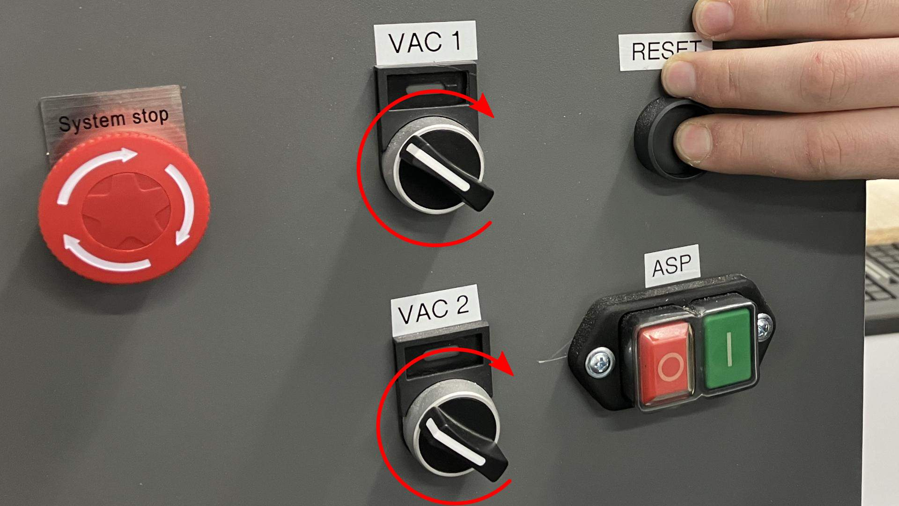

Vakuuma vilkmei jābūt tik spēcīgai, lai materiālu nevarētu atvilkt no upurplates virsmas ar roku palīdzību. Ja šo vilkmi nav iepējams panākt, materiāla stiprināšanai nepieciešams izmantot klemmes.

## Instrumenta maiņa

Frēzes instrumentu parasti izvēlas pēc nepieciešamās detalizācijas pakāpes, kā arī vēlamās galējās virsmas kvalitātes. Izmēra (diametra) ziņā, mazāka diametra frēze dod iespēju izgriezt smalkākas detaļas, bet lēnāk. Lielāka diametra frēze ir piemērota lielākām detaļām un griezīs ātrāk.

Darbnīcā ir pieejamas tā saucamās *upcut* un *downcut* frēzes. *Upcut* vai uz augšu virzošā frēze rada mazāku slodzi iekārtai Z ass (uz augšu, leju) virzienā. Griežot, skaidas tiek izvadītas ārā no izfrēzētā kanāla, tādējādi neradot pretspiedienu, bet saplākšņa un mazāk blīva koka gadījumā, uzraut virsējā slāņa skaidas uz augšu, radot nepieciešamību veikt papildu apstrādi. Lai no tā izvairītos, var izmantot tā saucamo *downcut* vai uz leju virzošo frēzi. Šīs frēzes asmeņi ir savērpti tā, lai skaidas tiktu virzītas materiāla virzienā, tādējādi nodrošinot maksimāli gludu griezuma ārējo malu, līdz ar to samazinot nepieciešamību veikt pēcapstrādi.

Pirms turpināt darbu, nepieciešams atmontēt esošo frēzi. Tam paredzētā mazākā atslēga jānovieto augstāk un kreisajā pozīcijā un lielākā atslēga jānovieto zemākā pozīcijā pa labi. Cangas uzgrieznis, kurš tiek satverts ar lielāko atslēgu, tiek atskrūvēts spiežot lielāko atslēgu mazākās atslēgas virzienā ar vienas rokas palīdzību, lai izvairītos no nevajadzīgām traumām. Pareizu atmontēšanu skatīties zemāk redzamajā video.

> **Svarīgi!** Šī procesa gaitā obligāti jānovelk cimdi.

Pēc vēlamās frēzes veida un izmēra izvēles, jāatrod arī piemērota canga. Cangas iekšējam diametram jāsakrīt ar frēzes kāta diametru. Frēzes kātam bez grūtībām, bet ar nelielu berzes pretestību, būtu jāieslīd cangā.  

> **Svarīgi!** Pārliecinies vai cangā un cangas uzgrieznī nav sakrājušās skaidas. 

Tālāk frēzes uzgrieznis ar tajā ievietoto cangu un frēzi jāuzskrūvē spindeļa vītnei. Jāpārliecinās, ka instruments ir iebīdīts cangā pietiekami dziļi, bet ne dziļāk kā dažus milimetrus pirms frēzes asmeņu sākumlīmenim.

> **Svarīgi!** Šī procesa gaitā obligāti jānovelk cimdi.

## Nulles punkta iestatīšana

Parasti darba fails tiek sagatavots, balstoties uz koordinātu sistēmu, kas balstīta uz materiāla izmēriem. Šī darba failā saglabātā koordinātu sistēma ir jāsalāgo ar reālo materiāla atrašanās vietu uz iekārtas darba virsmas. 

Kā pirmais solis šim procesam ir pārslēgšanās uz **MPG** režīmu, kas ļauj izmantot iekārtai pievienoto pozicionēšanas pulti.

Uz pults ir divi rotējošie slēdži. Kreisais slēdzis ļauj pārslēgties starp iekārtas X, Y un Z asīm. Slēdzis labajā pusē ļauj pārslēgt soļa izmēru, līdz pat 0.001mm (milimetra tūkstošdaļas) precizitātei.

X ass kustība notiek starp austrumiem (+) un rietumiem (-), Y ass kustība notiek starp ziemeļiem (+) un dienvidiem (-), Z ass kustība notiek starp augšu (+) un leju (-).

Ar pults palīdzību frēzes gals jānostāda vietā, kura atbilst darba failā noteiktajai sākuma pozīcijai. Īpaša uzmanība jāpievērš Z ass novietojumam. Ar pults precizitātes iespēju palīdzību, frēzes asmenis jāpietuvina materiāla virsmai tik tuvu, lai tas knapi tai pieskārtos un griežoties gandrīz noņemtu nelielu skaidu.

### Nulles iestatīšana X un Y asīm

Nākamais solis ir norādīt šo fizisko pozīciju kā procesa sākum- (vai nulles) pozīciju iekārtas datorsistēmā. Lai to izdarītu, jāsāk ar klikšķi uz **SETUP** pogas.

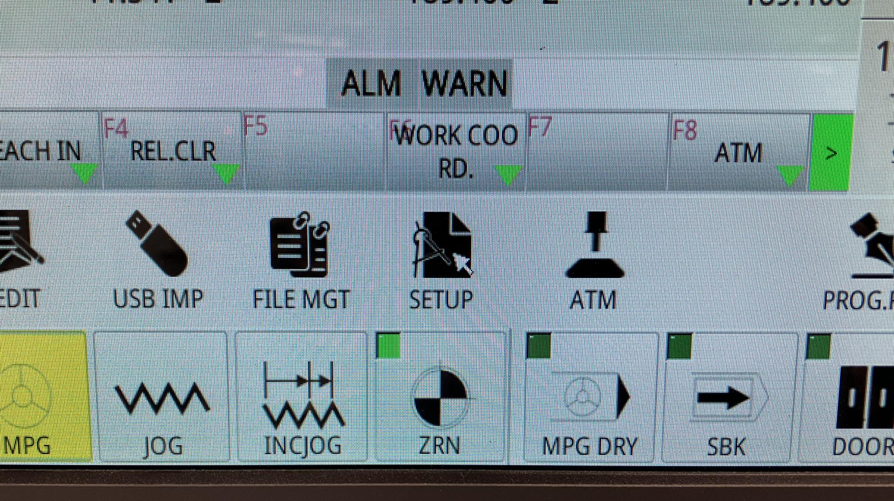

Tad jāuzklikšķina uz **X** vērtības lauka **G54** kolonnā. Tam būtu jāiekrāsojas zilā krāsā.

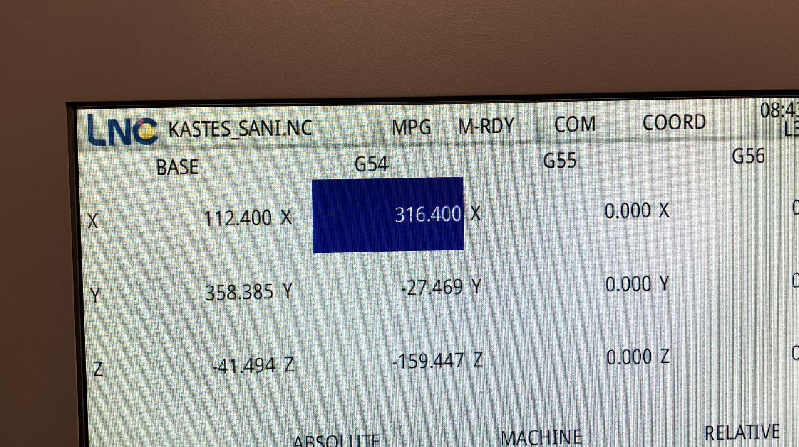

Zemāk lietotnē redzamajā ievades laukā, jāievada **0**.

Tad jānospiež taustiņš **Enter** uz iekārtas klaviatūras.

Sekojoši, **ABSOLUTE** sadaļā, X vērtība nomainīsies uz attālumu starp G54 nulles pozīciju un esošo frēzes novietojumu pa X asi. Lai panāktu to, ka **ABSOLUTE X** vērtība pārtop par nulli, **G54 X** pozīcija ir jāmaina uz esošo **ABSOLUTE X** vērtību. Tāpēc ievades laukā mēs ievadam tieši to pašu skaitli, ko redzam **ABSOLUTE X** vērtības laukā.

Un atkal nospiežam **Enter** uz iekārtai pieslēgtās klaviatūras.

Tagad jāpārliecinās vai **ABSOLUTE X** vērtība patiešām ir **0**.

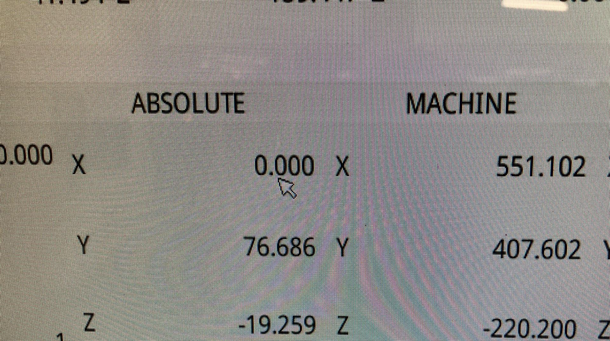

Šo pašu procesu jāatkārto ar ieklikšķinātu **G54 Y** vērtības lauku. Jāpārliecinās, ka **ABSOLUTE Y** vērtība arī pārtop par nulli. 

> **Svarīgi!** Z ass nulles vērtības iestatīšanai tiek izmantota cita metode, kas aprakstīta zemāk.

### Nulles iestatīšana Z asij

Lai iestatītu **ABSOLUTE Z** nulles vērtību, jāklikšķina uz **ATM** pogas.

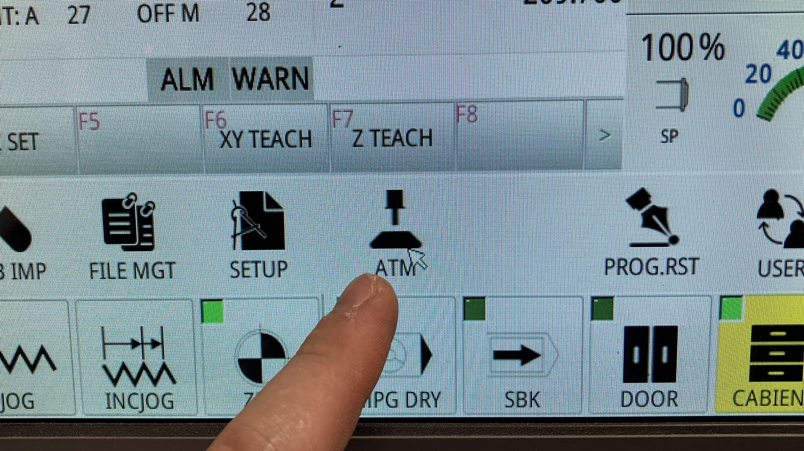

Tad jānospiež **Z SET** poga.

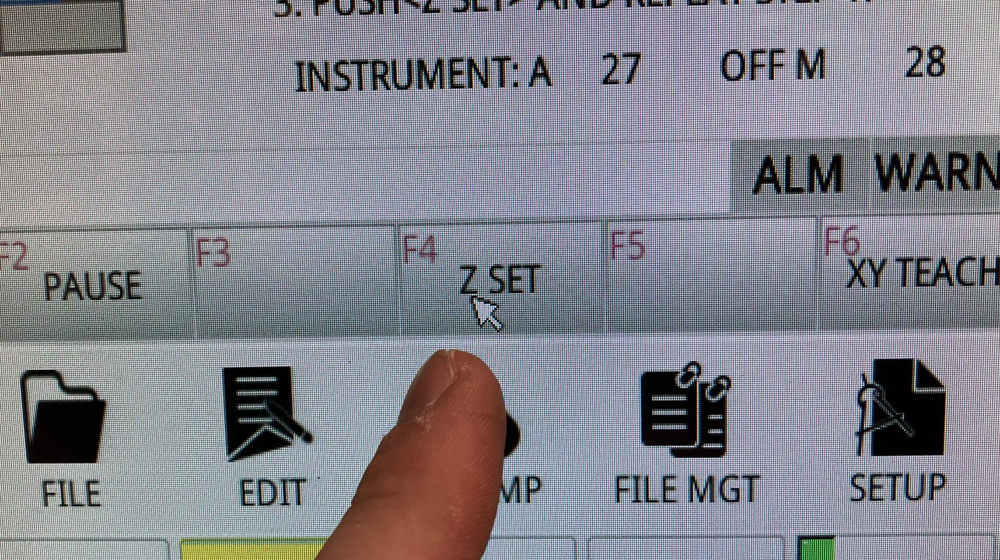

Lai pārliecinātos, ka **ABSOLUTE Z** pozīcija tiešām ir **0**, jāpārslēdzas uz **HOME** darba virsmu.

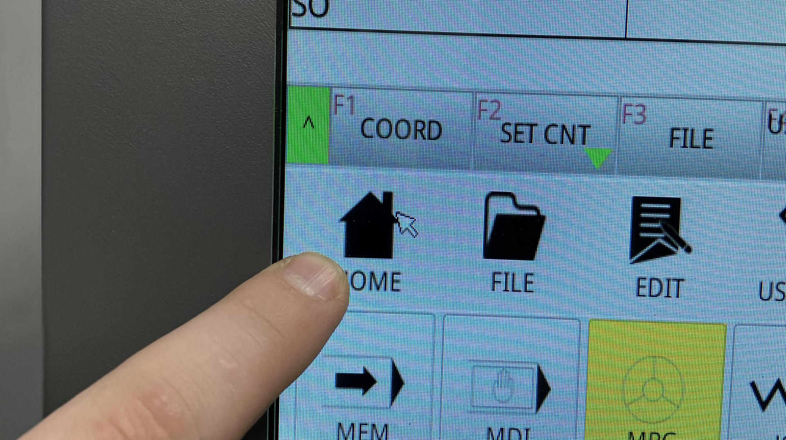

Šajā skatā, Z vērtībai vajadzētu būt **0**.

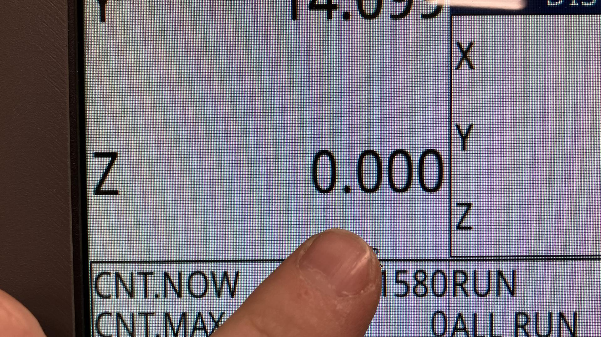

Tālāk varam veikt atlikušās darbības un palaist darba failu.

## Darba faila ielāde un palaišana

Pirms darba faila ielādes un palaišanas, nepieciešams spindeļa modulim piestiprināt skaidu nosūkšanas birsti. Tas palīdzēs uzsūkt un novadīt frēzēšanas gaitā radušās skaidas un putekļus.

### Darba faila ielāde

Darba failu nepieciešams ielādēt USB datu pārneses modulī (pirkstiņā) un ievietot CNC iekārtas USB ligzdā.

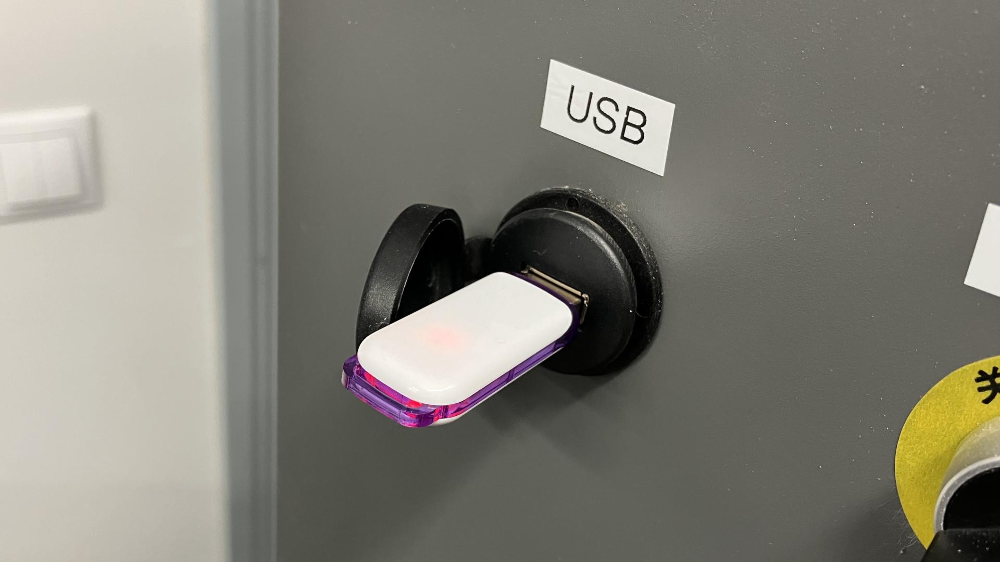

Tad jānospiež **USB IMP** poga, kas atvērs USB failu kopēšanas pārlūka darba virsmu.

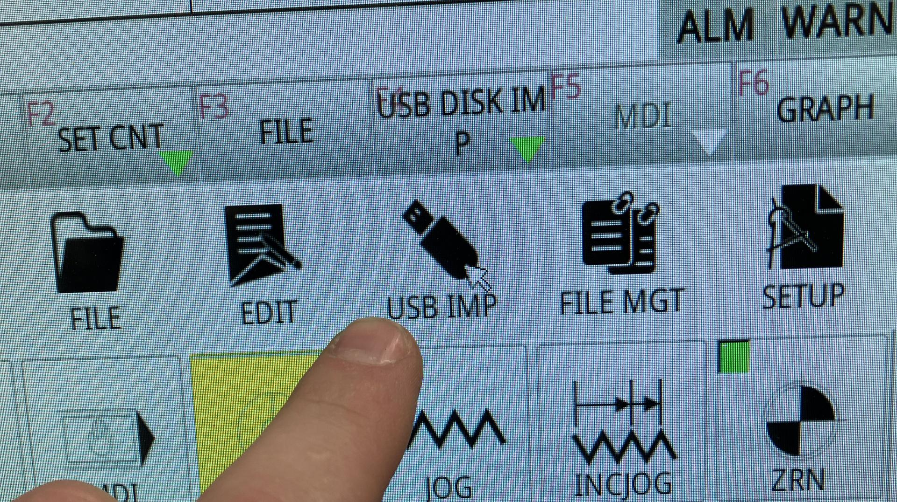

Labajā pārlūka pusē jāatrod un jāuzklikšķina uz vēlamā darba faila.

Tad jānospiež poga **SEND**.

Jānogaida kamēr darba fails ir pārkopēts CNC iekārtas atmiņā. Būtu jāredz **Transfer Complete** ziņa lietotnes kreisajā apakšējā daļā.

### Darba faila simulācija

Pirms darba faila palaišanas, ir ieteicams drošības labad pārliecināties vai iekārta atpazīst darba failā saglabātās komandas. Tam ir paredzēta simulācijas funkcija, kurai var piekļūt klikšķinot uz **EDIT** pogas.

Šajā lietotnes darba virsmā iespējams simulēt darba faila izpildi un redzēt frēzes kustības plānotās trajektorijas, kā arī to, kur frēze kustēsies pāri materiālam un kur tā iegremdēsies tajā, un cik dziļi.

### Darba faila palaišana

Visbeidzot mēs esam gatavi palaist darba failu. Lai to izdarītu, mums jāatgriežas **HOME** darba virsmā nospiežot **HOME** pogu.

Pēdējo reizi pārliecinamies, ka ielādētais darba fails ir tas, ko mēs gribam.

Un spiežam uz zaļās **START** pogas labajā apakšējā lietotnes stūrī.

Katram gadījumam turam pirkstu virs sarkanās drošības pogas un peles kursoru virs **PAUSE** pogas lietotnes labajā apakšējā stūrī.

Saglabājot modrību sagaidām kamēr iekārta pabeidz darbu.

Izmantojam iepriekš apgūtās metodes instrumenta atbīdīšanai pietiekamā attālumā drošai gatavo detaļu noņemšanai no iekārtas darba galda virsmas.

Novērtējam gatavās detaļas kvalitāti.

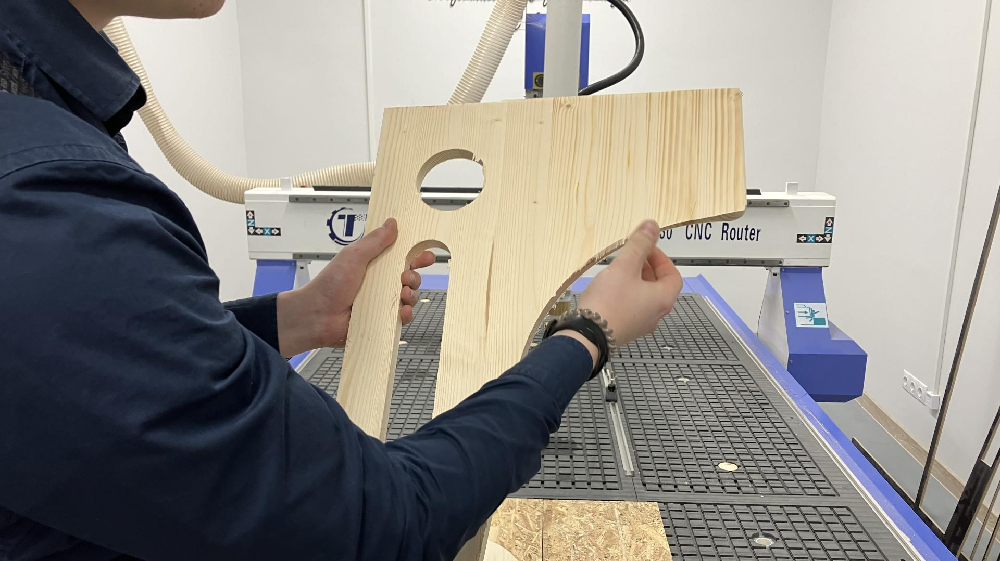

> **Svarīgi!** Cieni citus. Sakop aiz sevis. Atstāj darba vidi labākā kārtībā nekā tā bija, kad ieradies. 
