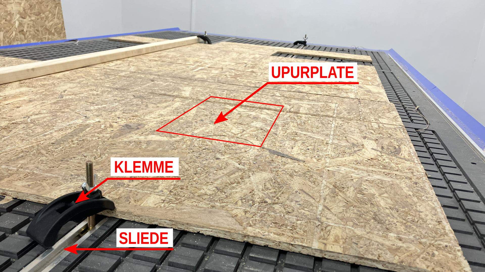
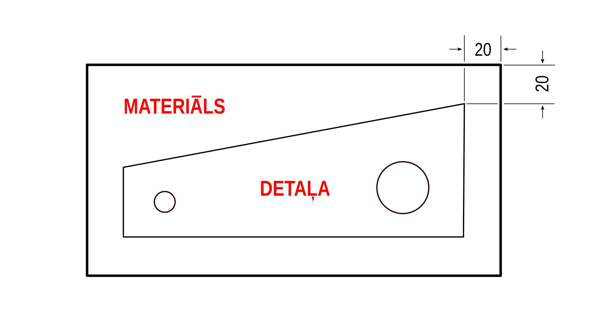
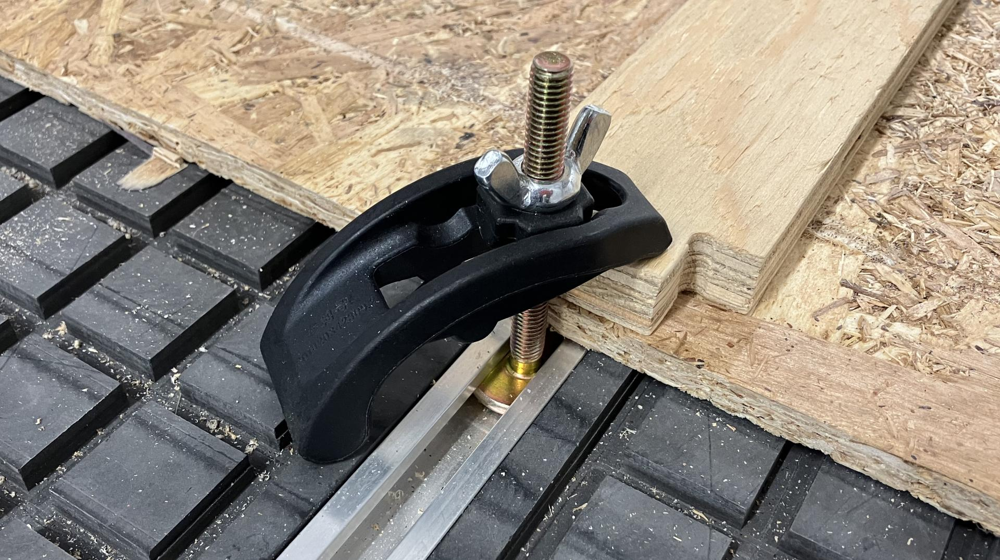
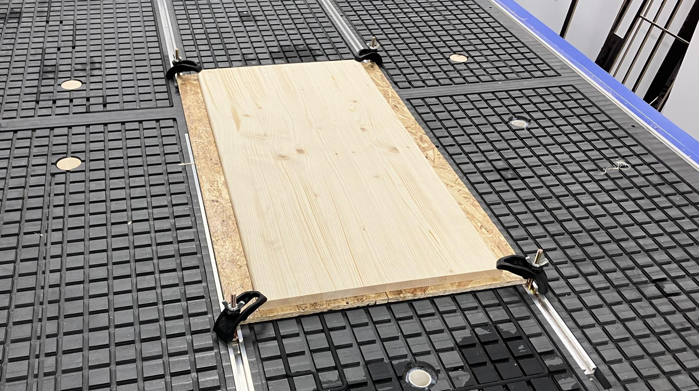

# Darba uzsākšana ar TRW 350 CNC frēzi

Šajā sadaļā ir atrodama informācija par to kā uzsākt darbu ar TRW 350 CNC frēzi. Pēc šīs sadaļas izlasīšanas, lietotājs spēs veikt sekojošās darbības.

- Uzstādīt materiālu iekārtas darba laukumā
- Uzstādīt vai nomainīt iekārtas frēzes asmeni
- Iestatīt sākuma punktus iekāŗtas X, Y un Z asīm
- Ielādēt un palaist darba failu

Darba faila sagatavošanai ieteicams izmantot Vectric V-Carve Pro programmatūru un tas tiks aprakstīts atsevišķā sadaļa.

## Darba virsmas sagatavošana

Ir svarīgi pārliecināties par iekārtas darba laukuma tīrību. Darba stacija ir aprīkota ar putekļu sūcēju, ko ieteicams izmantot šī aspekta nodrošināšanai.

TRW 350 CNC frēze ir aprīkota ar vakuumgaldu un sliedēm stiprinājum-klemmēm. Starp apstrādei paredzēto materiālu un darba galdu nepieciešams ievietot "upurplati". Tā ir aptuveni 10 mm bieza poraina materilāla (MDF vai OBS) plāksne. "Upurplate" palīdz novērst iespēju sabojāt iekārtas galda virsmu neparedzētu kļūmju gadījumā, kā arī nodrošina gaisa plūsmu starp apstrādei paredzēto materiālu un vakuuma galdu. 

## Materiāla izvēle

Izvēloties materiālu detaļu izgatavošanai, ir svarīgi ņemt vērā iespējamās darba procesa neprecizitātes. Ir vienmēr labāk ierēķināt papildu 20mm platumam un garumam nekā riskēt ar detaļu neprecizitāti vai zemāku drošības standartu.

## Materiāla stiprināšana

Stingra materiāla nostiprināšana ir svarīgs priekšnosacījums ne tikai augstas kvalitātes rezultātam, bet arī drošībai. Frēzes rotācijas ātrums ir mērāma desmitos tūkstošu apgriezienos minūtē. Salīdzinājumam, pamēģini apgriezties ap savu asi kaut divdesmit reizes minūtē. Mēģini izplest rokas un aizskart kādu uz galda novietotu objektu. Novēro, kā objekts nevis vienkārši nokrīt no galda, bet no tā aizlido rotācijas virzienā. 

> Mēģini iztēloties, kas notiktu, ja tavs rotācijas ātrums būtu tūkstoš reizes ātrāks.

Darbā ar TRW 350 CNC iekārtu, ir pieejami divi materiāla stiprināšanas veidi, kas detalizēti aprakstīti zemāk.

## Materiāla stiprināšana ar klemmēm

Klemmes sastāv no četrām daļām.

1. Skrūves ar T-veida galvu, kas ir saderīga ar iekārtas galdā iebūvētajām sliedēm
2. Klemmes, kas paredzēta saskarei ar materiāla virsmu tās tievākajā galā, un iekārtas galdu resnākajā galā
3. Plastmasas ielikņa.
4. Tauriņveida uzgriežņa, klemmes pievilkšanai galda virzienā.

Klemmes nepieciešams "iebīdīt" iekārtas darba virsmas sliedēs. 

Pietiekamai materiāla stiprināšanai ieteicams izmantot 4 klemmes. Laba stiprināšanas prakse redzama attēlā zemāk.

## Materiāla stiprināšana ar vakūmgaldu

Atkarībā no materiāla izmēriem, nepieciešams atvērt vienu vai vairākus vakuuma vārstus. Katrs no deviņiem vārstiem atver vai noslēdz vakuuma ietekmi uz vienu no deviņiem vakuuma galda blokiem. Attēlā zemāk var redzēt staistību starp vakuuma vārstiem un vakuuma galda blokiem (skatoties no iekārtas priekšpuses).

Vakuuma galdu ieteicams izmantot liela izmēra (>1000x1000mm) materiāla plākšņu stiprināšanai. Nav ieteicams vakuumgaldu izmantot poraina materiāla stiprināšanai. 

Svarīgs priekšnosacījums korektai vakuuma galda darbībai ir gumijas blīvju ievietošana. Ieteicams šīs blīves darba galdā ievietot tā, lai tās ierobežotu gaisa plūsmu vietās, kur paredzēts stiprināt materiālu.

